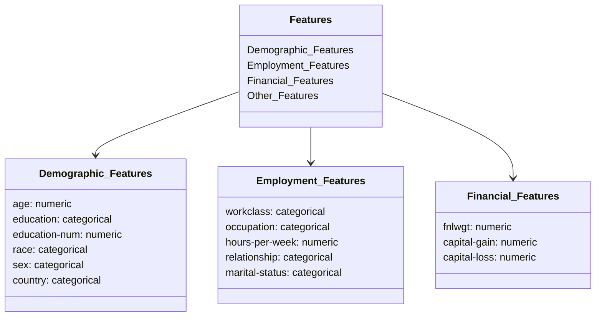

# MWC-Module-3-Modular-Workflow-and-Project-Setup-Basics
# Problem Statement:
## Business Context:
The project aims to develop a machine learning system that predicts individual income levels based on demographic and employment data.

The prediction boundary is set at $50,000 annually (binary classification problem).

The solution will help in understanding socio-economic factors affecting income levels.

Enable data-driven decision making for policy makers and financial institutions.

Identify key socio-economic factors influencing income disparities.

Support targeted intervention programs for economic development

## How to run (important)

If you run a file inside `src/` directly like:

```bash
python src/components/data_ingestion.py
```

Python sets `sys.path` to `src/components`, so the top-level package `src` is **not** importable and you’ll see:

`ModuleNotFoundError: No module named 'src'`.

Run modules from the **repository root** using `-m` instead:

```bash
python -m src.components.data_ingestion
```

### Install dependencies

Make sure you have installed the required packages (preferably in a virtual environment):

```bash
pip install -r requirements.txt
```

### (Recommended) Editable install

If you want `import src...` to work from anywhere, install the project in editable mode:

```bash
pip install -e .
```

## Key Stakeholders
**Policy Makers:** For evidence-based policy development
**Financial Institutions:** For risk assessment and product development
**Social Services:** For resource allocation and program planning
**Research Organizations:** For socio-economic studies
# Dataset Details:
Let's visualize the data structure and features:

